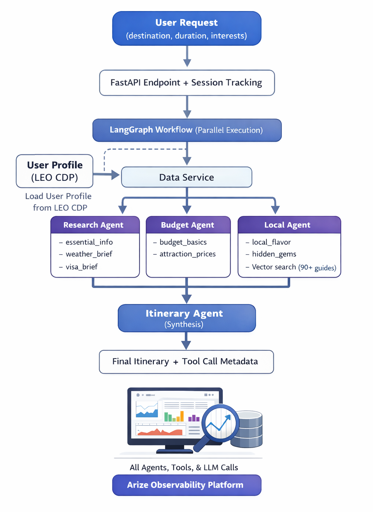

# ✈️ AI-Native Trip Planner (Multi-Agent)

A **production-grade multi-agent orchestrator** built with Gemini 2.0 Flash and LangGraph. 
This system demonstrates how to build "Privacy-First" personalized AI by integrating a **Customer Data Platform (LEO CDP)** and **PostgreSQL 16** into a parallel-processing agentic workflow.

## 🌟 Core Architecture Patterns

- 🤖 **Parallel Agent Orchestration**: Uses **LangGraph** to fan-out Research, Budget, and Local agents simultaneously for low-latency responses.
- 📂 **OOP Data Service**: A decoupled Strategy-pattern factory to load user profiles from **LEO CDP**, **PostgreSQL 16**, or any CRM.
- ⚡ **Gemini 2.0 Flash**: Optimized for speed and "native tool-use" capabilities.
- 👁️ **Local Observability**: Full OTLP tracing with **Arize Phoenix** for real-time debugging of agent logic and tool calls.
- 🛡️ **Graceful Degradation**: Intelligent fallbacks for web search (Tavily/SerpAPI) to ensure the system never fails silently.

---

## 🏗️ System Architecture




```text
┌─────────────────────────────────────────────────────────────────┐
│                        User Request                             │
│               (destination, duration, user_id)                  │
└────────────────────────────────┬────────────────────────────────┘
                                 │
                   ┌─────────────▼─────────────┐
                   │    FastAPI + Phoenix      │
                   │    Session & Trace ID     │
                   └─────────────┬─────────────┘
                                 │
                   ┌─────────────▼─────────────┐
                   │   LangGraph Workflow      │
                   │   (Entry: START Node)     │
                   └─────────────┬─────────────┘
                                 │
                   ┌─────────────▼─────────────┐
                   │    Data Service Loader    │
                   │  (LEO CDP / Postgres 16)  │
                   └─────────────┬─────────────┘
                                 │
        ┌────────────────────────┼────────────────────────┐
        │                        │                        │
   ┌────▼─────┐           ┌──────▼─────┐           ┌──────▼─────┐
   │ Research │           │   Budget   │           │   Local    │
   │  Agent   │           │   Agent    │           │   Agent    │
   └────┬─────┘           └──────┬─────┘           └──────┬─────┘
        │                        │                        │
        │ Tools:                 │ Tools:                 │ RAG Engine:
        │ • Weather/Visa         │ • Cost Analysis        │ • PGVector
        │ • Safety Info          │ • Exchange Rates       │ • Local Gems
        │                        │                        │
        └────────────────────────┼────────────────────────┘
                                 │
                          ┌──────▼──────┐
                          │  Itinerary  │
                          │   Agent     │
                          │ (Synthesis) │
                          └──────┬──────┘
                                 │
                   ┌─────────────▼─────────────┐
                   │   JSON / Markdown Output  │
                   │   + Tool Trace Metadata   │
                   └───────────────────────────┘

     Tracing & Evals → Arize Phoenix (Local OTLP:6006)
```

---

## 🛠️ Quickstart with Google Colab 

https://colab.research.google.com/drive/1KaLKUzFPC7uECGAHDZ7xW1LzjbdpiqQO?usp=sharing

## 🛠️ Quickstart with local python code

### 1. Requirements
- Python 3.10+
- **Arize Phoenix** (for tracing)
- **PostgreSQL 16** (optional, for profile storage)

### 2. Configure Environment
Create a `.env` file by coping `sample.env` in the `backend/` directory:

### 3. Installation

```bash
cd backend
python -m venv venv
source venv/bin/activate
pip install --upgrade pip
pip install -r requirements.txt
```

### 4. Terminal 1: Start Phoenix for Tracing
```bash
# Terminal 1: Start Phoenix for Tracing
python -m phoenix.server.main serve

```
### 5. Terminal 2: Run the AI service

```bash
# make sure you are back in the root directory of ai-trip-planner
cd ..
./start.sh                      # starts backend on 8000; serves minimal UI at '/'
# or
cd backend && uvicorn main:app --host 0.0.0.0 --port 8000 --reload
```

### 6. ENDPOINTS
- Frontend: http://localhost:3000
- API: http://localhost:8000
- Docs: http://localhost:8000/docs
 - Minimal UI: http://localhost:8000/

Docker (optional)
```bash
docker-compose up --build
```
---


## Project Structure
- `backend/`: FastAPI app (`main.py`), LangGraph agents, tracing hooks.
- `backend/services/`: The OOP Data Service layer (Strategy Pattern).
- `frontend/index.html`: Minimal static UI served by backend at `/`.
- `optional/airtable/`: Airtable integration (optional, not on critical path).
- `test scripts/`: `test_api.py`, `synthetic_data_gen.py` for quick checks/evals.
- Root: `start.sh`, `docker-compose.yml`, `README.md`.

## Development Commands
- Backend (dev): `uvicorn main:app --host 0.0.0.0 --port 8000 --reload`
- API smoke test: `python "test scripts"/test_api.py`
- Synthetic evals: `python "test scripts"/synthetic_data_gen.py --base-url http://localhost:8000 --count 12`

## API
- POST `/plan-trip` → returns a generated journey plan.
  Example body:
  ```json
  {"destination":"Tokyo, Japan","duration":"7 days","budget":"$2000","interests":"food, culture"}
  ```
- GET `/health` → simple status.

## Optional Features

### RAG: Vector Search for Local Guides

The local agent can use vector search to retrieve curated local experiences from a database of 90+ real-world recommendations:

- **Enable**: Set `ENABLE_RAG=1` in your `.env` file
- **Requirements**: Requires `OPENAI_API_KEY` for embeddings
- **Data**: Uses curated experiences from `backend/data/local_guides.json`
- **Benefits**: Provides grounded, cited recommendations with sources
- **Learning**: Great example of production RAG patterns with fallback strategies

When disabled (default), the local agent uses LLM-generated responses.

See `RAG.md` for detailed documentation.

### Web Search: Real-Time Tool Data

Tools can call real web search APIs (Tavily or SerpAPI) for up-to-date travel information:

- **Enable**: Add `TAVILY_API_KEY` or `SERPAPI_API_KEY` to your `.env` file
- **Benefits**: Real-time data for weather, attractions, prices, customs, etc.
- **Fallback**: Without API keys, tools automatically fall back to LLM-generated responses
- **Learning**: Demonstrates graceful degradation and multi-tier fallback patterns

Recommended: Tavily (free tier: 1000 searches/month) - https://tavily.com

## Next Steps

1. **🎯 Start Simple**: Get it running, make some requests, view traces
2. **🔍 Explore Code**: Read through `backend/main.py` to understand patterns
3. **🛠️ Modify Prompts**: Change agent behaviors to see what happens
4. **🚀 Enable Features**: Try RAG and web search
5. **💡 Build Your Own**: Use Cursor to transform it into your agent system

## Troubleshooting

- **401/empty results**: Verify `OPENAI_API_KEY` or `OPENROUTER_API_KEY` in `backend/.env`
- **No traces**: Ensure Arize credentials are set and reachable
- **Port conflicts**: Stop existing services on 3000/8000 or change ports
- **RAG not working**: Check `ENABLE_RAG=1` and `OPENAI_API_KEY` are both set
- **Slow responses**: Web search APIs may timeout; LLM fallback will handle it

---

## 💡 Customization Ideas
- **CRM Integration**: Add a `SalesforceService` class to the `DataServiceFactory`.
- **Constraint-Based Planning**: Modify the `Budget Agent` to pull real-time currency conversion from an external API.
- **Visual Itineraries**: Connect the `Itinerary Agent` to a Map API to return GeoJSON coordinates.

---

## 🚀 Learning Paths

### 🧬 Data & Personalization (The "CDP" Path)
1. **Understand the Factory**: Explore `services/data_service.py` to see how the system switches between **LEO CDP** (API) and **PostgreSQL** (SQLAlchemy).
2. **Profile-Driven Context**: See how the `load_profile` node injects user preferences (e.g., "likes luxury," "is vegan") into the agents without hardcoding.

### 🤖 Agent Orchestration (The "LangGraph" Path)
1. **Parallelism**: Trace how `research` and `budget` nodes execute at the same time.
2. **State Management**: Learn how `Annotated[List, operator.add]` in `TripState` allows multiple agents to contribute to a shared message history without overwriting each other.

### 🔍 Observability (The "Phoenix" Path)
1. **Local Tracing**: Spin up Phoenix (`phoenix serve`) and watch the spans generate as Gemini calls tools.
2. **Debugging**: Identify exactly which tool or agent caused a latency spike or a hallucination.

---

## Learning Paths

### 🎓 Beginner Path
1. **Setup & Run** (15 min)
   - Clone repo, configure `.env` with your Gemini Key
   - Start server: `./start.sh`
   - Test API: `python "test scripts/test_api.py"`

2. **Observe & Understand** (30 min)
   - Make a few trip planning requests
   - View traces in Arize dashboard
   - Understand agent execution flow and tool calls

3. **Experiment with Prompts** (30 min)
   - Modify agent prompts in `backend/main.py`
   - Change tool descriptions
   - See how it affects outputs

### 🚀 Intermediate Path
1. **Enable Advanced Features** (20 min)
   - Set `ENABLE_RAG=1` to use vector search
   - Add `TAVILY_API_KEY` for real-time web search
   - Compare results with/without these features

2. **Add Custom Data** (45 min)
   - Add your own city to `backend/data/local_guides.json`
   - Test RAG retrieval with your data
   - Understand fallback strategies

3. **Create a New Tool** (1 hour)
   - Add a new tool (e.g., `restaurant_finder`)
   - Integrate it into an agent
   - Test and trace the new tool calls

### 💪 Advanced Path
1. **Change the Domain** (2-3 hours)
   - Use Cursor AI to help transform the system
   - Example: Change from "trip planner" to "PRD generator"
   - Modify state, agents, and tools for your use case

2. **Add a New Agent** (2 hours)
   - Create a 5th agent (e.g., "activities planner")
   - Update the LangGraph workflow
   - Test parallel vs sequential execution

3. **Implement Evaluations** (2 hours)
   - Use `test scripts/synthetic_data_gen.py` as a base
   - Create evaluation criteria for your domain
   - Set up automated evals in Arize

## Common Use Cases (Built by Students)

Students have successfully adapted this codebase for:

- **📝 PR Description Generator**
  - Agents: Code Analyzer, Context Gatherer, Description Writer
  - Replaces travel tools with GitHub API calls
  - Used by tech leads to auto-generate PR descriptions

- **🎯 Customer Support Analyst**
  - Agents: Ticket Classifier, Knowledge Base Search, Response Generator
  - RAG over support docs instead of local guides
  - Routes tickets and drafts responses

- **🔬 Research Assistant**
  - Agents: Web Searcher, Academic Search, Citation Manager, Synthesizer
  - Web search for papers + RAG over personal library
  - Generates research summaries with citations

- **📱 Content Planning System**
  - Agents: SEO Researcher, Social Media Planner, Blog Scheduler
  - Tools for keyword research, trend analysis
  - Creates cross-platform content calendars

- **🏗️ Architecture Review Agent**
  - Agents: Code Scanner, Pattern Detector, Best Practices Checker
  - RAG over architecture docs
  - Reviews PRs for architectural concerns

**💡 Your Turn**: Use Cursor AI to help you adapt this system for your domain!

---
**Updated by Triều** | *Expertise in LEO CDP, RAG, and AI-Native Systems.*

